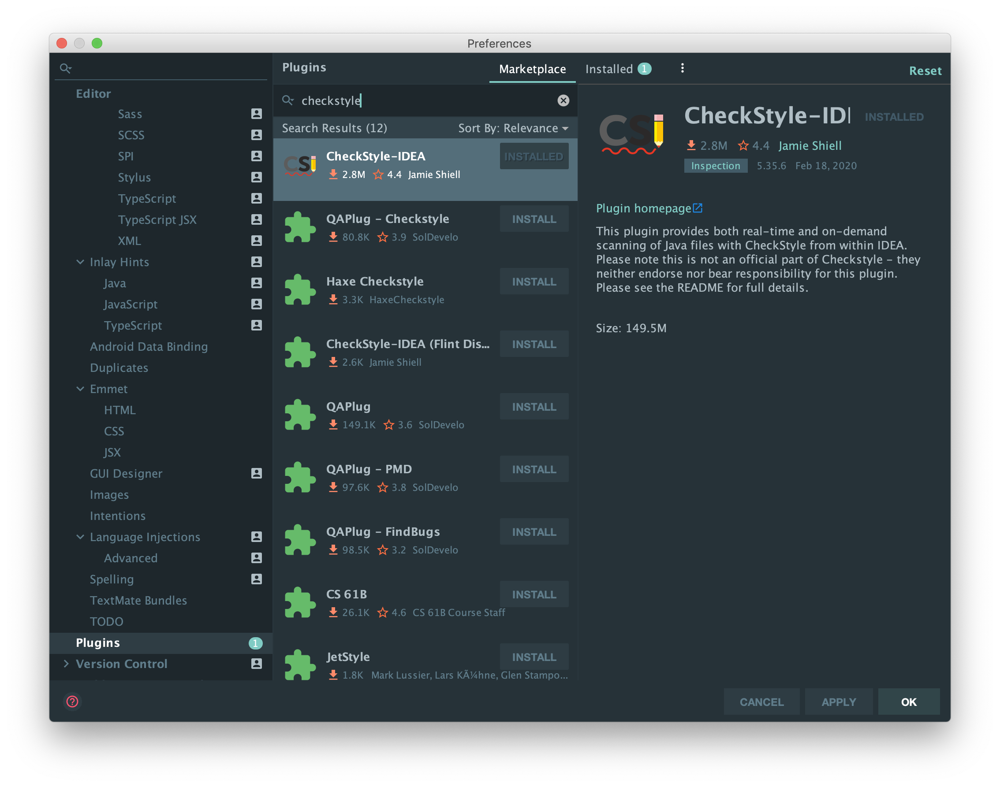

<!-- START doctoc generated TOC please keep comment here to allow auto update -->
<!-- DON'T EDIT THIS SECTION, INSTEAD RE-RUN doctoc TO UPDATE -->
**Table of Contents**  *generated with [DocToc](https://github.com/thlorenz/doctoc)*

- [IntelliJ Setup](#intellij-setup)
  - [Installing IntelliJ](#installing-intellij)
  - [Importing the Project into IntelliJ](#importing-the-project-into-intellij)
  - [Configuring Hot Deploy on IntelliJ](#configuring-hot-deploy-on-intellij)
  - [Configuring Formatting on IntelliJ](#configuring-formatting-on-intellij)

<!-- END doctoc generated TOC please keep comment here to allow auto update -->

# IntelliJ Setup

One of the great features of Spring Boot is its capability to auto-reload on detecting file changes. However, the downside is that it does not watch the actual `.java`, `.kt`, etc. files in `src/`, but rather the compiled files in `build/`. If you are using IntelliJ, this is simplified as you can easily configure it to auto-build on save.

## Installing IntelliJ

**You will need IntelliJ Ultimate**. Luckily, as students you should be able to get it for free:

[Link to JetBrains Student](https://www.jetbrains.com/student/)

From here, you should be able to acquire a license for IntelliJ ultimate and you should follow instructions to port it over.

## Importing the Project into IntelliJ

Once IntelliJ starts up, you should select **New > Project from Existing Sources...** and point it to this repository, and it should automatically detect that this is a Gradle project due to `build.gradle` being in root of this project.

## Configuring Hot Deploy on IntelliJ

While there is a handy "Build project automatically" under **IntelliJ > Preferences > Build, Execution, Deployment > Compiler**. However, this is *does not rebuild if you are running locally*. If you are using the Docker, you can check the box and end here, as the Docker Compose will sync your build files with the docker instance.


Otherwise if you absolutely *must* test locally, you can perform these additional steps to enable building while the server is running (and thus trigger the Spring LiveReload server upon save): You will need to enable the `compiler.automake.allow.when.app.running` from the registry.

Entering `Ctrl` + `Alt` + `Shift` + `/` (or `Command` + `Option` + `Shift` + `/` on Mac) will open a dialog box on IntelliJ, select `Registry`.


Then search for `compiler.automake.allow.when.app.running` and enable it.

## Configuring Formatting on IntelliJ

As part of `pre-commit`, there is a hook that checks your project's code against Google's `checkstyle` configuration - if your code doesn't meet certain styling guidelines, it will not allow you to the commit the code unless it conforms to it. Unfortunately, unlike `eslint` in `gs-frontend`, `checkstyle` will *not* automatically fix those issues for you. However, IntelliJ can.

First, you will need the `IDEA Checkstyle Plugin`. Go to **Preferences > Plugins**. Under **Marketplace**, search for **Checkstyle-IDEA** and install it.



Next, go to **Editor > Code Style > Java**. Under **Scheme**, click the hamburger menu, **Import Scheme > CheckStyle Configuration** and navigate to `gs-backend/checkstyle/google_checks.xml`.


Next, under **Javadoc**, navigate to **Other** and ensure that *Generate "<p>" on empty lines* is unchecked and *Do not wrap one line comments* is checked, so it should look like this:


Next under **Imports**, scroll down to **Import Layout** and make sure it looks like this:


Essentially, it has to look like

```
import static all other imports
<blank line>
import all other imports
<blank line>
```

As by default importing the CheckStyle XML will cause there to be two blank lines to be inserted between `import static` and all other imports, which will cause errors. Now your IntelliJ formatting is good to go!

Now, if you right click on a file/directory, if you select **Reformat Code** it should format it according to the CheckStyle guidelines!


Make sure you mask the files with the `*.java` qualifier as we only want to run this on Java files.
